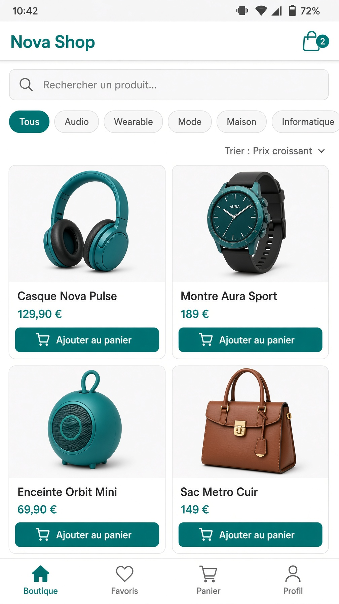
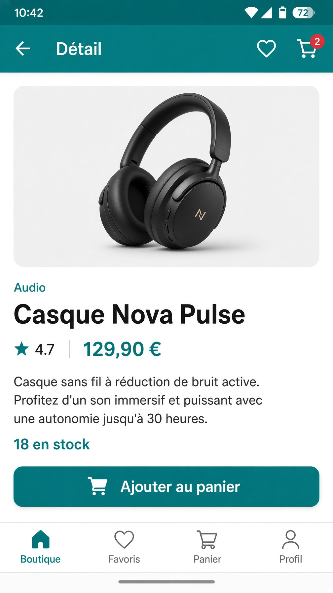
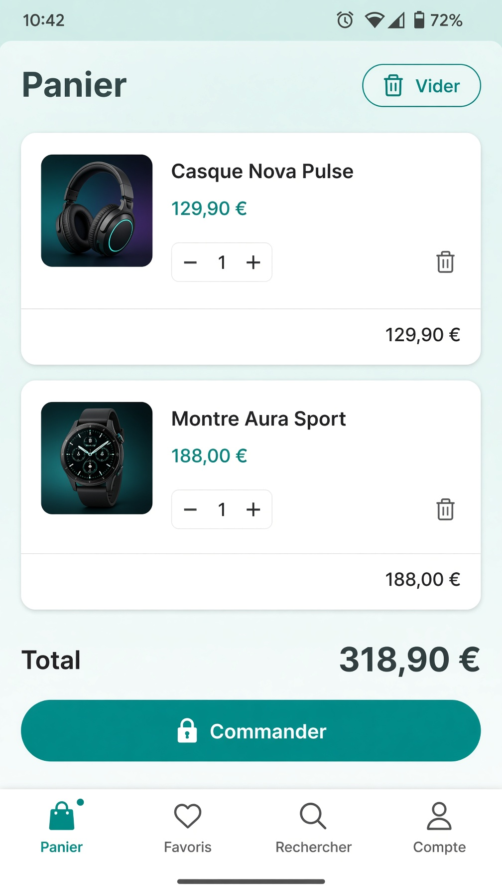
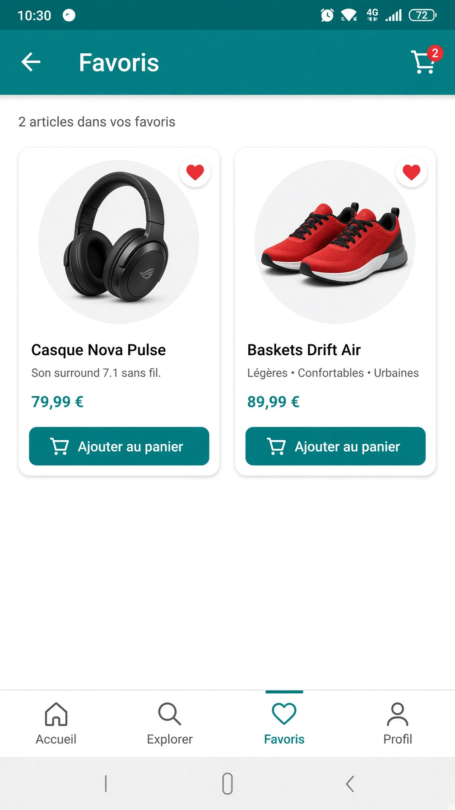
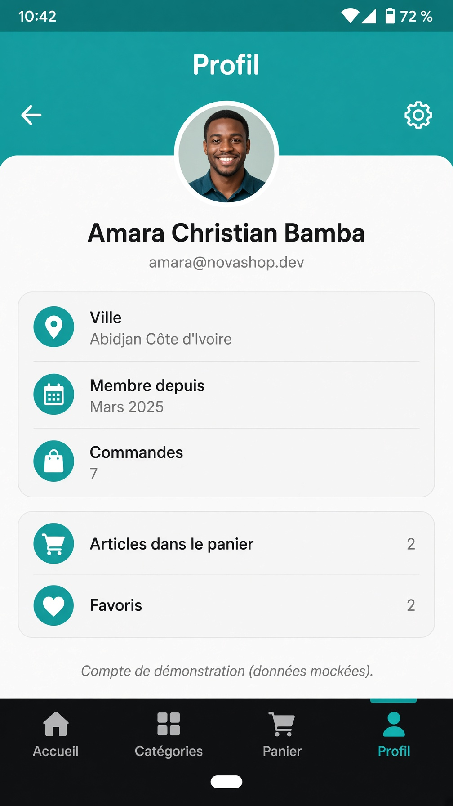

# Nova Shop

Application **e-commerce Flutter** avec **Riverpod** : catalogue, détail produit, panier, favoris persistés, filtres/tri, profil mock.

Repo : [https://github.com/boss-last/nova_shop](https://github.com/boss-last/nova_shop)

## Fonctionnalités

- Catalogue (grille) + fiche produit
- Panier : ajout, suppression, quantité, total, commande simulée
- Favoris persistés avec `SharedPreferences`
- Recherche, filtre par catégorie, tri (prix / note)
- Profil utilisateur mocké
- États **loading / error / data** via `AsyncValue` (bouton Réessayer)
- Animation légère : snackbar + badge panier à l’ajout

## Architecture en couches

```
lib/
├── main.dart                         # ProviderScope
├── core/                             # thème, format prix
├── data/
│   ├── models/                       # Product, CartItem, CatalogFilter, UserProfile
│   ├── datasources/                  # JSON local + latence (fake API)
│   └── repositories/                 # ProductRepository
├── domain/
│   └── filter_products.dart          # logique métier filtrage/tri
└── presentation/
    ├── providers/                    # Riverpod uniquement
    ├── screens/
    └── widgets/                      # UI sans accès datasource
```

Flux : **Datasource → Repository → Providers → Widgets**.  
Les widgets ne connaissent que les providers. Aucune donnée hardcodée dans l’UI.

## Providers (≥ 5)

| Provider | Type | Rôle |
|---|---|---|
| `productRepositoryProvider` | `Provider` | Injection du repository |
| `productsProvider` | `FutureProvider<List<Product>>` | Catalogue async (`AsyncValue`) |
| `productByIdProvider` | `FutureProvider.family` | Détail async |
| `catalogFilterProvider` | `StateNotifierProvider` | Recherche, catégorie, tri |
| `filteredProductsProvider` | `Provider<AsyncValue<…>>` | Liste dérivée filtrée |
| `cartProvider` | `StateNotifierProvider` | Panier (add/remove/qty) |
| `cartItemCountProvider` | `Provider<int>` | Badge |
| `cartTotalProvider` | `Provider<double>` | Total |
| `favoritesProvider` | `StateNotifierProvider<AsyncValue<Set>>` | Favoris persistés |
| `favoriteProductsProvider` | `Provider<AsyncValue<List>>` | Produits favoris |
| `userProfileProvider` | `FutureProvider<UserProfile>` | Profil mock |

Données produits : `assets/data/products.json` (fake API avec délai).

## Lancement

```bash
git clone https://github.com/boss-last/nova_shop.git
cd nova_shop
flutter pub get
flutter run
```

## Captures d'écran

| Catalogue | Détail | Panier |
|:---:|:---:|:---:|
|  |  |  |

| Favoris | Profil |
|:---:|:---:|
|  |  |

## Checklist

- [x] Catalogue liste + détail
- [x] Panier (ajout, suppression, quantité)
- [x] Favoris persistés localement
- [x] Filtrage et tri
- [x] Profil utilisateur mock
- [x] Riverpod exclusivement
- [x] ≥ 5 providers
- [x] Architecture en couches
- [x] Loading / erreur + `AsyncValue`
- [x] Données mock JSON

## Licence

MIT
